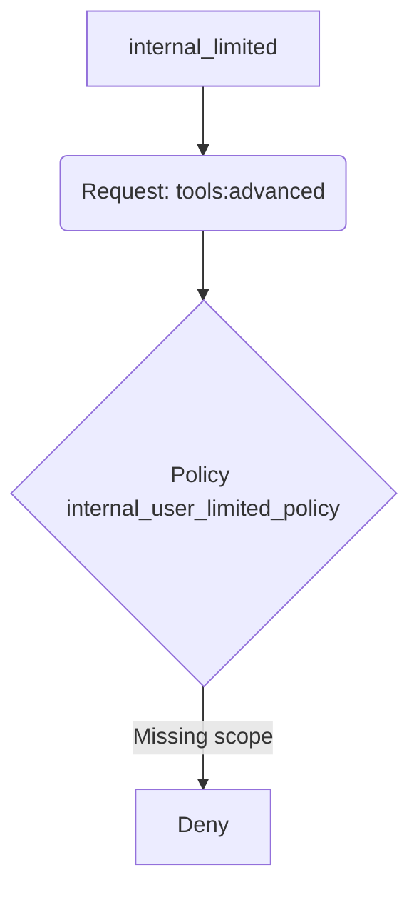

# AgenticTrust Access-Control Scenarios

This document illustrates how **users**, **scopes**, and **policies** configured in `/configs` interact to decide whether a particular *agentic call* is **allowed (+)** or **denied (−)**.

> Legend  
> **Tool Classes** – `basic`, `advanced`, `agent`, `limited`, `external_basic`  
> **Policies** – `internal_user_policy`, `internal_user_limited_policy`, `external_user_policy`, `deny_suspended_agents`  
> **Users** – defined in `configs/users.yml`

| # | Scenario | Actor (User) | Requested Action | Key Scopes Required | Policy Evaluation | Decision |
|---|----------|--------------|------------------|---------------------|-------------------|----------|
| 1 | Internal user performs an *agentic chain* that calls several internal tools (basic ＋ advanced) and invokes another agent as a tool. | **internal_full** (`is_external: false`) | `tools:basic`, `tools:advanced`, `tools:agent` | User’s policy **internal_user_policy** contains all three tool scopes. Conditions satisfied (`is_external=false`, human-in-the-loop) | **Allow (+)** |
| 2 | Same chain as #1 executed by a *limited* internal user. | **internal_limited** | `tools:basic`, `tools:advanced`, `tools:agent` | Policy **internal_user_limited_policy** only grants `tools:limited`; `tools:advanced`/`tools:agent` missing. | **Deny (−)** – limited user can’t access advanced/agent tools. |
| 3 | Limited internal user calls a *single* internal limited tool. | **internal_limited** | `tools:limited` | Granted by **internal_user_limited_policy**; conditions met. | **Allow (+)** |
| 4 | External end-user calls an external public tool. | **external_basic** (`is_external: true`) | `tools:external_basic` | Granted by **external_user_policy** | **Allow (+)** |
| 5 | External end-user attempts to call internal *basic* tool. | **external_basic** | `tools:basic` | Policy **external_user_policy** lacks this scope → not permitted | **Deny (−)** |
| 6 | Internal full user tries a privileged admin function (`support:client.manage`). | **internal_full** | `support:client.manage` | Not in **internal_user_policy**; additionally `human_in_the_loop` would trigger | **Deny (−)** – requires **admin_policy** user. |
| 7 | Internal full user is temporarily *suspended* (`agent.status = suspended`). | **internal_full** | Any action | `deny_suspended_agents` (priority 200) matches → **explicit deny** | **Deny (−)** overrides all allow policies. |

### Detailed Scenario Analysis

#### Scenario 1 – Internal Full Access Chain
**User**: `internal_full` (internal employee)  
**Policy**: `internal_user_policy` (priority 55)  
**Requested scopes**: `tools:basic`, `tools:advanced`, `tools:agent`

1. The platform aggregates the scopes required by the composite task (multiple tool calls plus agent-as-tool).
2. Policy engine evaluates `internal_user_policy` first (highest priority among user’s policies).
3. All required scopes are present and the condition `agent.is_external == false` passes.
4. `human_in_the_loop.required = true` triggers a supervisor confirmation prompt; once the human approves, the policy returns **allow**.
5. Access is logged in task & audit tables.

**Outcome**: ✅ *Allowed* – full execution proceeds.

---

#### Scenario 2 – Limited Internal User Attempts Full Chain
**User**: `internal_limited`  
**Policy**: `internal_user_limited_policy` (priority 45)  
**Requested scopes**: `tools:basic`, `tools:advanced`, `tools:agent`

1. Engine checks `internal_user_limited_policy` – it only grants `tools:limited`.
2. Missing scopes (`tools:advanced`, `tools:agent`) cause immediate **deny**; no fallback policy for this user exists.
3. A denial reason is returned to the caller and audited.

**Outcome**: ❌ *Denied* – insufficient scopes.

---

#### Scenario 3 – Limited Internal User Calls a Limited Tool
**User**: `internal_limited`  
**Policy**: `internal_user_limited_policy`  
**Requested scope**: `tools:limited`

1. Required scope matches exactly what the policy provides.
2. Conditions (`is_external=false`, human-loop) pass; approver approves.

**Outcome**: ✅ *Allowed* – limited tool executes.

---

#### Scenario 4 – External End-User Calls External Tool
**User**: `external_basic` (external)  
**Policy**: `external_user_policy` (priority 10)  
**Requested scope**: `tools:external_basic`

1. Policy lists the necessary scope and requires human approval.
2. Condition `agent.is_external == true` passes.

**Outcome**: ✅ *Allowed* – public-facing tool is executed.

---

#### Scenario 5 – External End-User Requests Internal Tool
**User**: `external_basic`  
**Policy**: `external_user_policy`  
**Requested scope**: `tools:basic`

1. `external_user_policy` lacks `tools:basic`; evaluation fails.
2. No other policy for the user supplies the scope → **deny**.

**Outcome**: ❌ *Denied* – internal resources hidden from external users.

---

#### Scenario 6 – Internal Full User Requests Admin Function
**User**: `internal_full`  
**Policy**: `internal_user_policy`  
**Requested scope**: `support:client.manage`

1. Scope not present in `internal_user_policy`.
2. Engine continues but user has no `admin_policy`; request remains unmet.
3. Default deny returned.

**Outcome**: ❌ *Denied* – requires an administrator account.

---

#### Scenario 7 – Suspended Internal User
**User**: `internal_full` (status: *suspended*)  
**Policies**: normal user policies **but** global `deny_suspended_agents` (priority 200) applies.

1. Engine evaluates highest-priority rules first; `deny_suspended_agents` matches `agent.status == suspended`.
2. Because its `effect` is `deny`, evaluation short-circuits. No further policies are considered.

**Outcome**: ❌ *Denied* – suspension overrides all other grants.

---

## How Evaluation Works
1. **User ⇒ Scopes & Policies**  
   Each authenticated user is associated with one or more policies (and optionally extra direct scopes). Policies enumerate *allowed scopes* and evaluate additional **conditions** (e.g., `agent.is_external`, `human_in_the_loop`, time-/network-based, etc.).
2. **Agentic Call ⇒ Required Scopes**  
   Before the platform executes an action (tool call, ticket update, etc.) it builds a set of *required scopes*.
3. **Policy Engine**  
   The engine iterates through policies by descending `priority`. The first **explicit deny** immediately blocks access. The first **allow** that covers all required scopes and whose conditions evaluate to `true` yields success.  
   If no policy allows the request, the default is **deny**.

### Example Walk-Through – Scenario #2

- The user’s only policy lacks the `tools:advanced` scope, so the request is denied without consulting other lower-priority policies.

---

## Extending These Scenarios
Add more scopes or policies as needed, e.g.:
- **tools:analytics** – specialised data-analysis tools.  
- **partner_user_policy** – external partner employees with broader rights than public users.

Update `configs/*.yml` and re-run `load_initial_data()` (automatically triggered on next app start) to populate the database.

---

© AgenticTrust 2025
